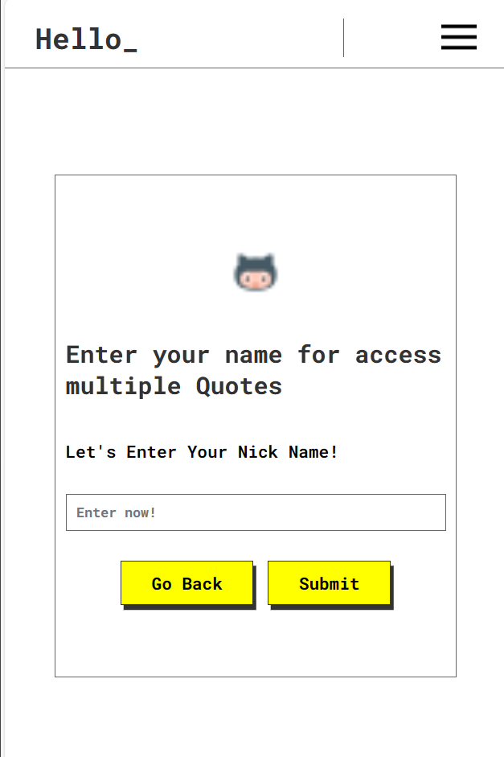

# Random Quotes / qUOTES

**[VISIT/CHECK LIVE](https://alizainaslam.github.io/Random-Quotes/)** 🔗

A simple web project using HTML5, CSS3, and JavaScript especially DOM practice including REST API.

The most Intresting part of this project is **USER-LOGIN** section. It can display after two quotes and user need to enter just name, IF user refuse it then it will appear again after two quotes.

## Table of Contents

- [Usage](#usage)
- [Features](#features)
- [Screenshots](#screenshots)
- [Contact Me on LinkedIn](#contact-me-on-linkedin)
- [Contributing](#contributing)
- [License](#license)

## Usage

To run this project:
clone `https://github.com/AleZayn/Random-Quotes.git`,
and open the `index.html` file in a web browser.

## Features

- **Feature 1:** Created navigation including social media links plus a nav item as a parent and inside it created two child nav.
- **Feature 2:** After two quotes, login page will display and ask for user name for giving access to the other quotes and user's name will display with greetings. If user refuse it then user can see it again after two quotes.

## Screenshots

## Contact Me on LinkedIn

You can connect with me on LinkedIn: [Ali Zain Aslam](https://www.linkedin.com/in/al%C3%ACzain/).

## Contributing

I welcome contributions to this project. If you'd like to contribute, please follow these guidelines:

1. Fork the project on GitHub.
2. Create a new branch with a descriptive name for your feature or bug fix.
3. Make your changes and test them thoroughly.
4. Submit a pull request, explaining the purpose of your changes and any relevant details.

I appreciate your contributions!

**API USED in this PROJECT**

- [Api Link](https://github.com/lukePeavey/quotable) 🔗

## License

This project is licensed under the MIT License - see the [LICENSE](https://github.com/AleZayn/Random-Quotes/blob/master/LICENSE) file for details.
